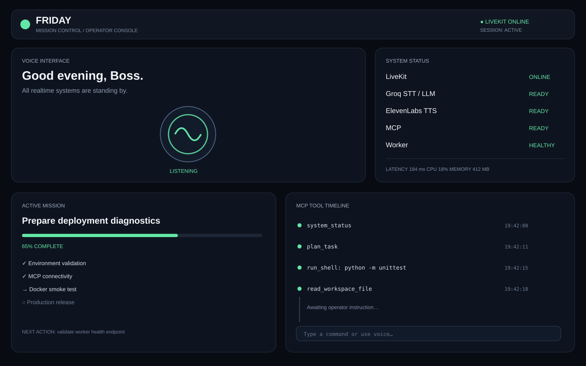

# FRIDAY AI Agent

A production-oriented realtime voice agent built around **LiveKit Agents**, **Groq**, **ElevenLabs**, **Silero VAD**, turn detection, and a custom **MCP server**.

FRIDAY is a cross-platform, voice-first mission-control assistant: concise, proactive, technically precise, calm under pressure, and suitable for local development or server deployment.

> **Security:** Never commit API keys, LiveKit credentials, OAuth tokens, or other secrets. Use `.env` locally and GitHub Actions Secrets for CI/CD.

## Current status

- **Runtime:** LiveKit voice worker + optional MCP server
- **AI:** Groq STT + LLM
- **Voice:** ElevenLabs TTS
- **Audio:** Silero VAD + turn detection
- **Tools:** Custom MCP server with workspace, command, URL, memory, status, and planning tools
- **Container:** Docker / Python 3.12
- **Development hosts:** Linux, macOS, Windows, WSL, and Android/Termux
- **Server deployment:** Docker or any supported Linux/Python host
- **CI:** GitHub Actions builds and validates the worker image
- **Native mobile UI:** Not required by the worker architecture; clients can connect through LiveKit
- **Publishing:** Release/deployment remains a separate later step

## UI demo snapshot

The repository includes a review-only UI concept showing the intended FRIDAY mission-control experience. It is a static design reference and is **not** a claim that a production dashboard is already deployed.



See `docs/UI_DEMO.md` for the design notes and component map.

## Architecture

```text
┌─────────────────────────────────────────────────────────┐
│                    FRIDAY CLIENTS                       │
│  Web │ Android │ iOS │ Desktop │ Termux │ CLI/Agents   │
└──────────────────────────┬──────────────────────────────┘
                           │ LiveKit
                           ▼
                 ┌──────────────────────┐
                 │  LiveKit Cloud/Self  │
                 └──────────┬───────────┘
                            │
                            ▼
                 ┌──────────────────────┐
                 │ FRIDAY LiveKit Worker│
                 ├──────────────────────┤
                 │ Groq STT             │
                 │ Groq LLM             │
                 │ Silero VAD           │
                 │ Turn Detector        │
                 │ ElevenLabs TTS       │
                 └──────────┬───────────┘
                            │
                            ▼
                 ┌──────────────────────┐
                 │     FRIDAY MCP       │
                 ├──────────────────────┤
                 │ Status / URL         │
                 │ Safe shell           │
                 │ Workspace files      │
                 │ Memory               │
                 │ Planning             │
                 └──────────────────────┘
```

## Features

### Realtime voice agent

`friday_agent/livekit_agent.py` runs the realtime worker and connects the LiveKit audio pipeline to Groq and ElevenLabs.

### MCP automation layer

`friday_agent/mcp_server.py` exposes FRIDAY tools through streamable HTTP. The tool layer includes:

| Capability | MCP tool/resource | Purpose |
| --- | --- | --- |
| Runtime status | `system_status`, `friday://status` | Runtime/platform information |
| URL access | `fetch_url` | Fetch public URLs with limits |
| Shell | `run_shell` | Execute only allow-listed commands |
| Files | `read_workspace_file`, `write_workspace_file`, `list_workspace_files` | Workspace-scoped UTF-8 file operations |
| Memory | `remember`, `recall` | Small persistent JSON facts |
| Planning | `plan_task` | Compact execution plans |
| Operator prompt | `friday_operator_prompt` | Standardized mission prompt |

## Cross-platform support

FRIDAY is a **Python/LiveKit worker**, so the development and client environment can be separated from the production worker.

| Platform | Development | Worker | Recommended path |
| --- | --- | --- | --- |
| Linux | ✅ | ✅ | Python or Docker |
| macOS | ✅ | ✅ | Python or Docker |
| Windows | ✅ | ⚠️ | WSL2 or Docker recommended |
| WSL2 | ✅ | ✅ | Python or Docker |
| Android / Termux | ✅ | ⚠️ | Termux for development; Docker/server for worker |
| Web | Client | N/A | LiveKit web client |
| iOS | Client | N/A | LiveKit client app |
| Docker hosts | N/A | ✅ | Recommended production runtime |

The table distinguishes **development/host support** from **native client support**. The core repository is not a native Android/iOS application.

## Repository layout

```text
.
├── .github/workflows/friday-build.yml  # CI validation
├── docs/
│   ├── ARCHITECTURE.md                # System architecture
│   ├── DEPLOYMENT.md                  # Deployment paths
│   ├── INSTALL.md                     # Platform install commands
│   ├── RELEASE.md                     # Future publishing/release process
│   ├── UI_DEMO.md                     # UI review notes
│   └── assets/friday-ui-demo.svg      # Static UI demo snapshot
├── friday_agent/
│   ├── livekit_agent.py                # Realtime voice worker
│   ├── mcp_server.py                   # MCP HTTP server
│   └── mcp_tools.py                    # Tool implementations
├── scripts/
│   └── run_background.sh               # Local background runner
├── tests/                              # Unit/environment tests
├── Dockerfile
├── requirements.txt
└── .env.example
```

## Environment configuration

Copy `.env.example` to `.env` and fill in your own credentials.

### Required

| Variable | Purpose |
| --- | --- |
| `LIVEKIT_URL` | LiveKit WebSocket URL |
| `LIVEKIT_API_KEY` | LiveKit worker API key |
| `LIVEKIT_API_SECRET` | LiveKit worker API secret |
| `GROQ_API_KEY` | Groq API access |
| `ELEVENLABS_API_KEY` | ElevenLabs TTS access |

### Model and voice configuration

| Variable | Purpose |
| --- | --- |
| `GROQ_LLM_MODEL` | Groq LLM model name |
| `GROQ_STT_MODEL` | Groq speech-to-text model name |
| `ELEVENLABS_VOICE_ID` | ElevenLabs voice ID |
| `ELEVENLABS_VOICE_LINK` | Optional shared ElevenLabs voice URL |

### Optional runtime controls

| Variable | Default | Purpose |
| --- | --- | --- |
| `FRIDAY_IDENTITY` | `friday-ai-agent` | Agent identity |
| `FRIDAY_INSTRUCTIONS` | FRIDAY default prompt | Agent behavior |
| `FRIDAY_WORKSPACE_ROOT` | Current directory | MCP workspace boundary |
| `FRIDAY_MEMORY_PATH` | `.run/memory.json` | Memory storage |
| `FRIDAY_ALLOWED_COMMANDS` | `pwd,python,python3,git,find,rg,cat` | Shell allow-list |
| `FRIDAY_MAX_TEXT_CHARS` | `6000` | Output size limit |
| `FRIDAY_MAX_WRITE_BYTES` | `1000000` | File-write size limit |

## Install on any supported development platform

The complete platform command reference is in `docs/INSTALL.md`.

### Linux / macOS / WSL2

```bash
git clone https://github.com/G27XLEO/FRIDAY-AI-AGENT-.git
cd FRIDAY-AI-AGENT-
python3 -m venv .venv
source .venv/bin/activate
python -m pip install -r requirements.txt
cp .env.example .env
```

### Windows PowerShell

```powershell
git clone https://github.com/G27XLEO/FRIDAY-AI-AGENT-.git
Set-Location FRIDAY-AI-AGENT-
py -3.12 -m venv .venv
.\.venv\Scripts\Activate.ps1
python -m pip install -r requirements.txt
Copy-Item .env.example .env
```

### Android / Termux

```bash
pkg update -y
pkg install -y git python
pkg install -y clang make pkg-config

git clone https://github.com/G27XLEO/FRIDAY-AI-AGENT-.git
cd FRIDAY-AI-AGENT-
python -m venv .venv
source .venv/bin/activate
python -m pip install -r requirements.txt
cp .env.example .env
```

If a native Python dependency is unavailable on a particular Android/Termux build, use Termux as the control/development environment and run the LiveKit worker in Docker or on a Linux server.

## Start FRIDAY

### MCP server

```bash
python -m friday_agent.mcp_server
```

### LiveKit worker

```bash
python -m friday_agent.livekit_agent dev
```

### Both locally

```bash
./scripts/run_background.sh
```

The runner stores runtime logs and PIDs under `.run/`.

## Docker

Build:

```bash
docker build --pull -t friday-ai-agent .
```

Run:

```bash
docker run --rm --env-file .env friday-ai-agent
```

For production, inject secrets through the hosting platform's secret manager rather than baking them into an image.

## GitHub Actions / CI

`.github/workflows/friday-build.yml` runs on pushes to `main` and pull requests. It builds the Docker image, inspects it, runs the unit tests inside the image, and performs protected runtime environment validation when GitHub Secrets are configured.

Required GitHub Actions Secrets:

```text
LIVEKIT_URL
LIVEKIT_API_KEY
LIVEKIT_API_SECRET
GROQ_API_KEY
ELEVENLABS_API_KEY
```

## Testing

```bash
python -m unittest discover -v
python -m compileall friday_agent tests
git diff --check
docker build --pull -t friday-ai-agent .
```

## Security

- Never commit secrets.
- Rotate credentials that were previously exposed.
- Keep MCP shell access allow-listed.
- Keep file operations inside a trusted workspace.
- Run production containers as non-root.
- Protect any publicly exposed MCP endpoint with authentication and transport controls.
- Treat voice credentials and third-party service tokens as production secrets.

## Publishing later

Publishing is **not performed by this update**. When ready, use the release gates in `docs/RELEASE.md`: security review → tests → immutable container build → registry push → production secrets → deployment → smoke test → versioned GitHub release.

## Roadmap

- Harden MCP authentication and authorization.
- Improve health/status reporting and startup diagnostics.
- Reduce voice latency and improve audio reliability.
- Add more MCP connectors and permission-aware automation.
- Add production container registry and release automation.
- Expand client integrations for web, Android, iOS, desktop, and terminal workflows.
- Add production observability, audit trails, and task-state management.

## License / usage

Review the repository license and third-party service terms before public distribution. Use only voices, credentials, models, and integrations that you are authorized to use.
